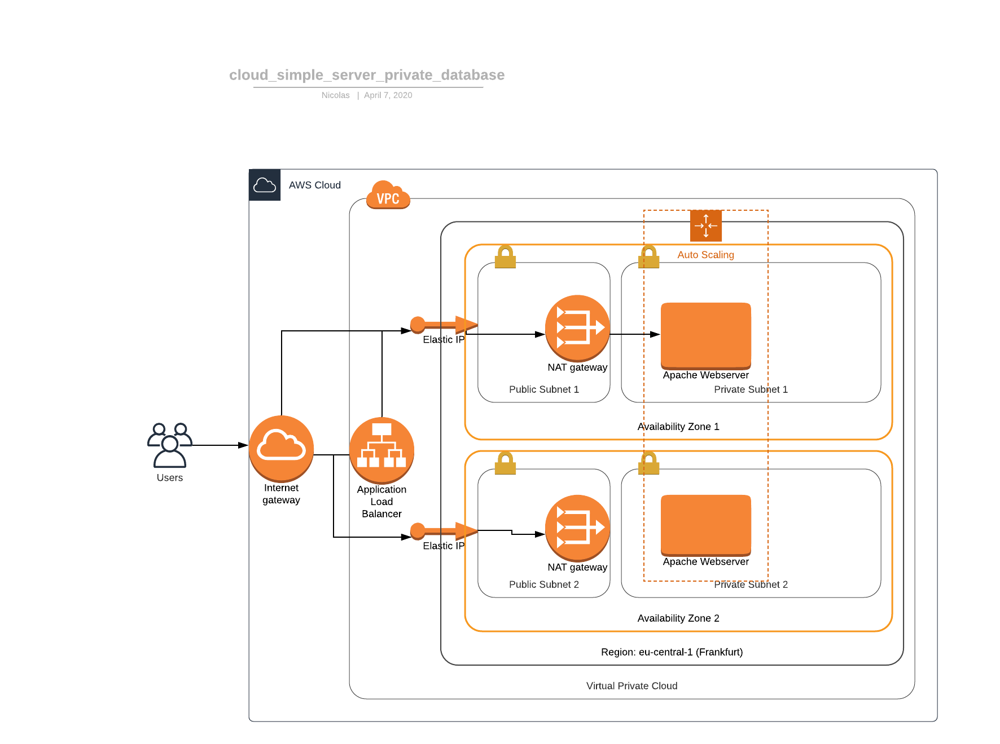
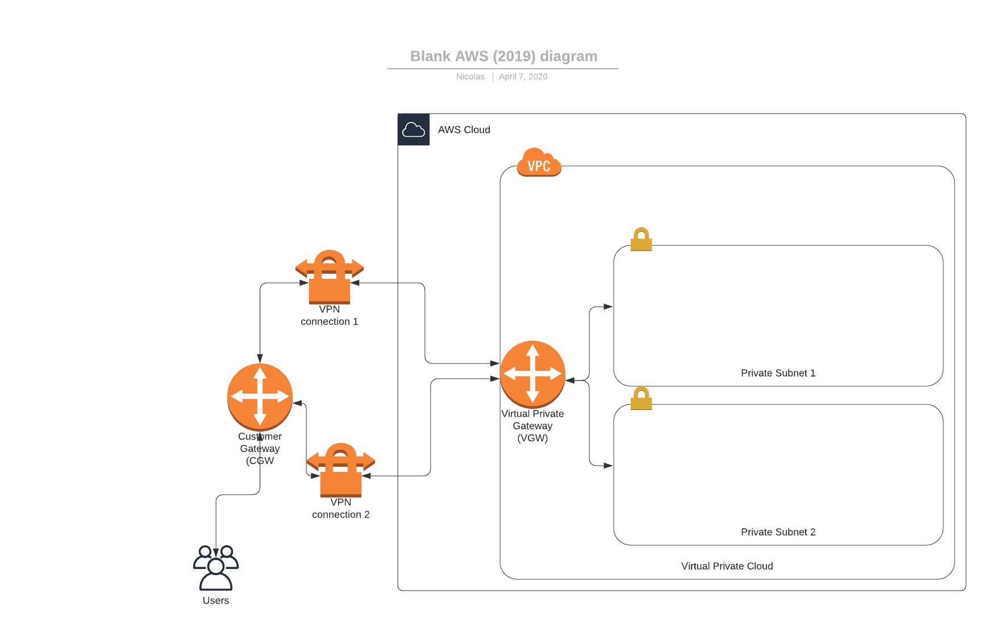

# AWS Sandbox

A collection of exemplary code using Amazon Web Services which were mostly created learning the usage of AWS Services. All examples were created using the second version of the AWS client on linux. Steps, required to install it, are shown [here](https://docs.aws.amazon.com/de_de/cli/latest/userguide/install-cliv2.html).

## Simple Server with private database

This example consists of a cloud architecture designed with AWS CloudFormation. It is built around a webserver that servers a customer with a simple HTTP content. The webserver is scaled horizontally by spinning up/down virtual webserver instances depending on the requesting demand.The request load is well balanced over all webserver instances using a load balancer which forwards traffic via a public subnet to corresponding private subnets containing the "backend". The backend also contains a MySQL database which can later serve for more features of the webserver



In order to create this architecture, run the following command:

```
cd <path-to-repository>/cloud_simple_server_private_database/
```

In the following the CloudFormation stacks with an arbitrary stack-name are created. Run the commands one by one, ensuring the stacks have been created successfully.

```
../manage_stack.sh test-network-1 cfn_network.yml parameters_network.json
../manage_stack.sh test-webservers-1 cfn_webservers.yml parameters_webserver.json
../manage_stack.sh test-database-1 cfn_databases.yml parameters_database.json
```


## VPN Connection to the Virtual Private Cloud

This example contains of the Infrastructure-as-Code files required to set up a VPN-Connection to a given private subnet within a Virtual Private Cloud using AWS CloudFormation. This is achieved by defining the VPN connection from the client-side gateway to the virtual private gateway (VGW) within the Virtual Private Cloud (VPC)



In order to create this architecture, run the following command:

```
cd <path-to-repository>/cloud_simple_server_private_database/
```

In the following the CloudFormation stacks with an arbitrary stack-anme are created. Run the commands one by one, ensuring the stacks have been created successfully.

```
../manage_stack.sh test-network-2 cfn_network.yml parameters_network.json
```
