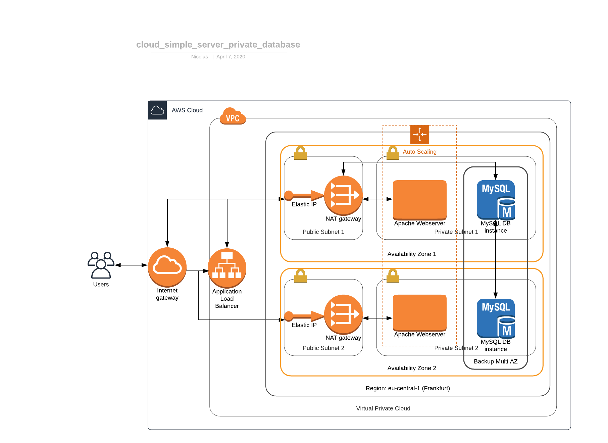

# AWS Sandbox

A collection of exemplary code using Amazon Web Services which were mostly created learning the usage of AWS Services.

## Simple Server with private database

This example consists of a cloud architecture designed with AWS CloudFormation. It is built around a webserver that servers a customer with HTTP content containing data from a private local database. The webserver is scaled horizontally by spinning up/down virtual webserver instances depending on the requesting demand.The request load is well balanced over all webserver instances using a load balancer which forwards traffic via a public subnet to corresponding private subnets containing the "backend".

## VPN Connection to the Virtual Private Cloud

This example contains of the Infrastructure-as-Code files required to set up a VPN-Connection to a given private subnet within a Virtual Private Cloud using AWS CloudFormation. This is achieved by defining the VPN connection from the client-side gateway to the virtual private gateway (VGW) within the Virtual Private Cloud (VPC)

